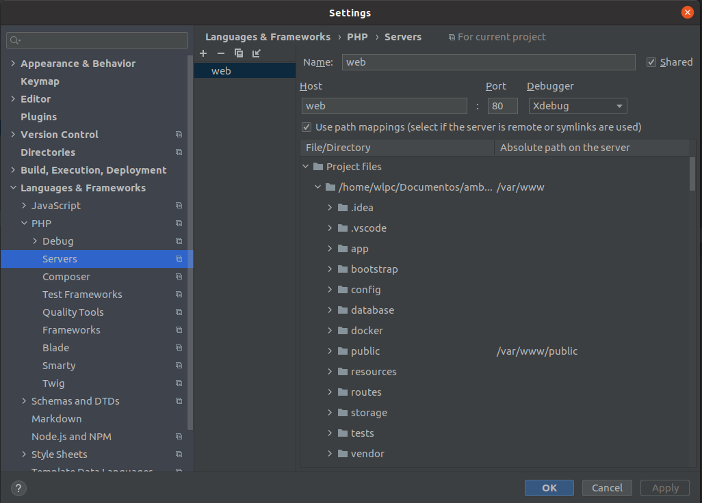
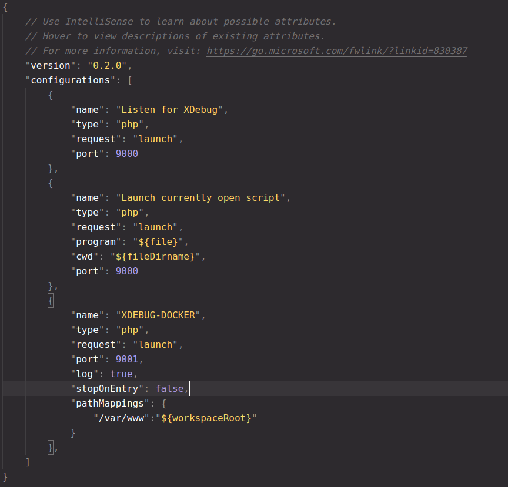

# Ambiente de Desenvolvimento - Laravel, MySQL 8, Suporte a Laravel MIX e Node.JS

Este ambiente de desenvolvimento permite executar aplicações Laravel, dando suporte para:

- Laravel Mix
- GD e plugins imagick e xdebug
- MySQL 8

## Organização do ambiente

O ambiente está dividido em pastas contendo versões do PHP, seguindo o padrão:

**php-"versao"-"sistema-operacional"**

## Como o ambiente funciona

O ambiente foi dividido em 3 principais containers e 5 containers opcionais

### Principais

- modphp: O PHP e o Apache em execução com modphp(modulo do apache para php), com os respectivos plugins e o **XDEBUG** . Este container também permite a personalização do php.ini, através de um arquivo **custom.ini** montado via bind volume.

- mysql8: Container com o DB e script de inicialização

- node: Para realizar build de JS com webpack

### Opcionais(uso de php-fpm)

Caso queira usar o php-fpm, existe o container do php fpm e dois servers (podendo escolher qual utilizar)

- phpfpm: O php fpm para uso de fast-cgi

- nginx: Se comunica com o **PHP-FPM** via **FAST-CGI**

- apachefpm: Se comunica com o **PHP-FPM** via **FAST-CGI**


Principais ferramentas usadas internamente nos containers:

* Foi aplicada a utilização da biblioteca **dockerize** nos containers, para
  permitir que os containers respeitem a **ordem correta de inicialização**.
  Ex. Container do php inicializar somente após o MySQL estiver respondendo.

* O container do **PHP espera o container de banco iniciar.** 

* O container do **nginx/apache, espera o PHP estar inicializado**

## Configuração de servidores

Por padrão está configurado o **APACHE com MODPHP**, porém no **docker-compose.yaml** há um setup **comentado** contendo o **Apache** e **Nginx**, para uso do PHP-FPM.

A configuração dos servidores está dessa forma:

O **apache com mod** php: **./docker/modphp/vhost.conf**

O **NGINX** está em **./docker/nginx/nginx.conf**

O **APACHEFPM** está em:

* **./docker/apache/httpd.conf**

* **./docker/apache/httpd-vhosts.conf**

## Como executar o ambiente?

* Clone o repositório, escolha a versão do php que quer usar, e copie a pasta **docker** e **docker-compose.yaml** para a raiz do projeto laravel

* Em seguida configure no .env as credenciais do banco de dados. **Lembrando que o host deve ser o nome do serviço docker responsável pelo banco**, neste caso é **db**. As credenciais podem ser encontradas no **docker-compose.yaml**

* Em seguida, na raiz do ambiente, execute o comando:
  
  ```shell
  # para garantir que a pasta com os entrypoints e demais infos tenha permissões de leitura/execução
  sudo chmod 777 -R ./docker
  docker-compose up -d
  ```

* Acesse o projeto na URL: 

http://localhost:8000

* Adicione no seu .gitignore os seguintes itens:
  * docker/dbdata: local onde estão os arquivos gerados pelo mysql
  * .composer: cache gerado pelo composer 2


## Estrutura final de pastas

```
...suas pasta do laravel
docker/
docker-compose.yaml
```

**O docker compose e a pasta docker devem estar na raiz do projeto**


## Permissões de usuário

Para evitar quaisquer problemas de permissões de usuário entre os containers
e o host que está executando o ambiente, os containers(php e mysql) foram configurados para executarem com um usuário específico, contendo o ID de usuário **1000**, o mesmo ID utilizado por muitas distribuições Linux para o usuário padrão.

Com essa personalização, não haverá conflitos de permissões em arquivos gerados
pelos containers.


## Exemplo de configuração das IDEs para debuggar

O Xdebug está **configurado na porta 9001**, para evitar conflitos com o PHP-FPM.

**PHPSTORM**



> Nota-se que o **name** e **host** são de acordo com o server_name do nginx.conf

**VSCODE**



> A configuração é a com nome de "XDEBUG-DOCKER"

## Debug em modo SWARM

Caso esse ambiente seja configurado para modo SWARM, é necessário fazer alguns ajustes pois ele apresenta um modelo de rede diferente, contendo uma rede **overlay**, que possui alguns comportamentos específicos a fim de suportar clusters e replicas.

Isso implica em um comportamento onde em certas requisições não é possível identificar o IP real do usuário, isso ocorre devido ao **ingress** e outros fatores de balanceamento do swarm, esse comportamento é similar ao que acontece em proxy reversos/load-balancer no **nginx**.

Para contornar o problema, podem ser feito:

- Colocar um proxy na frente, passando o cabeçalho **X-Real-IP**, afim de identificar o usuário original da request.

- Configurar o xdebug para no xdebug.remote_connect_back=1, utilizar o cabeçalho  **X-Real-IP**, sendo definido na config: xdebug.remote_addr_header

**Explicações do problema no Swarm**

**Cenário real explicando o problema:** https://www.nerd.vision/post/x-real-ip-with-docker-swarm-and-tcp-lb

**Issue do github, também com explicações:** https://github.com/moby/moby/issues/25526

**Exemplod de proxy pass:** https://github.com/moby/moby/issues/25526#issuecomment-248224302